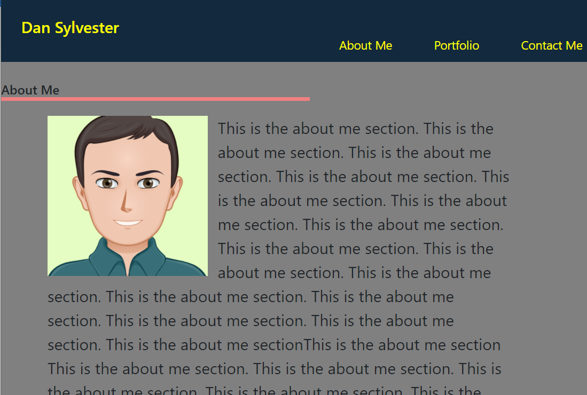
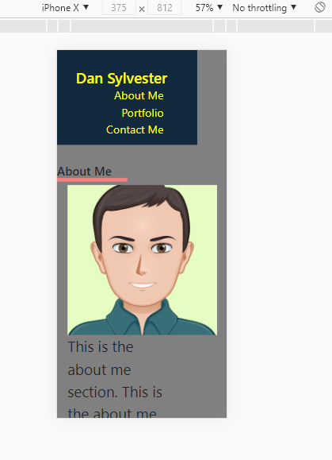

# homework02---Portfolio

I made a portfolio webpage from scratch using HTML and CSS. This includes a live URL that loads without errors and the Github page and repo are submitted.

The page resembles the README in general layout.

My repo has a unique name and I used class and id strucutre and added comments to my CSS and Github commits.

I have included this README with screenshots.

# Acceptance Criteria

The page shows my name and avatar photo with an about me section, portfolio section, and contact section. When you click the navigation links they scroll to that section of the page.

I ran out of time to make my first application larger, I will re-submit after learning more how to do that.

I also need to learn how to make each image link to a different application. I will resubmit once revisiting that.

I found that sometimes the layout resizes properly when in responsive mode and viewing different screen sizes, other times the layout does not resize properly. I am not sure why. I will keep working on that.

There is also some formatting that needs to be made to look better when screen size changes which I will work on.

Overall this was a very project that was more challenging than it first appeared. It helped me discover what areas of HTMl and CSS to focus on learning more about moving forward and I will prioritize this in the next week.

#Screenshot of page

#screenshot in responsive mode

